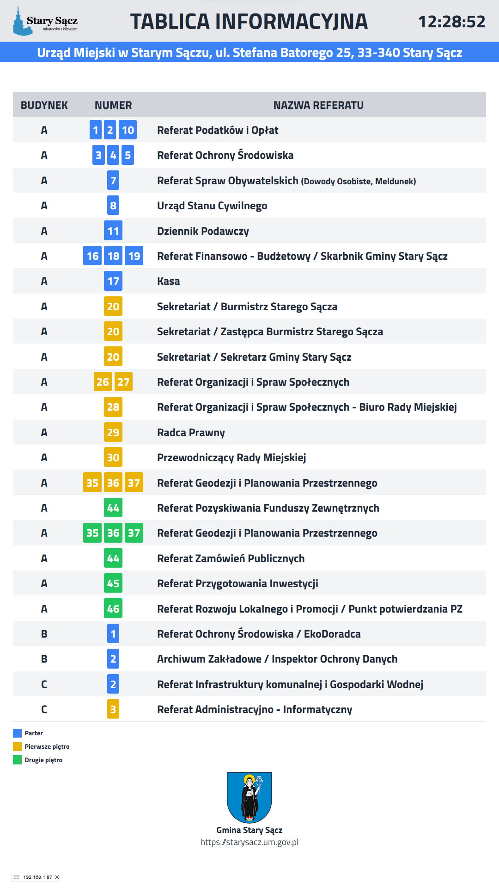

# Opis ogólny

Aplikacja webowa statyczna. Cel: wyświetlanie listy pomieszczeń wraz z numerami pomieszczeń dla Urzędu Miejskiego w Starym Sączu.

# Zrzut ekranu



# Demo

https://static.starysacz.um.gov.pl/tablica-parter

# Instalacja

Strona staryczna oparta o TailwindCSS. Instalacja jak przy każdym tego typu projekcie.

# Kiosk

Instalujemy system linux z dowolną powłoką graficzną (zalecana minimalna) oraz dowolną przeglądarką internetową.

Uruchomienie Firefox z konsoli:

```
firefox --kiosk url [link do strony]
``` 
